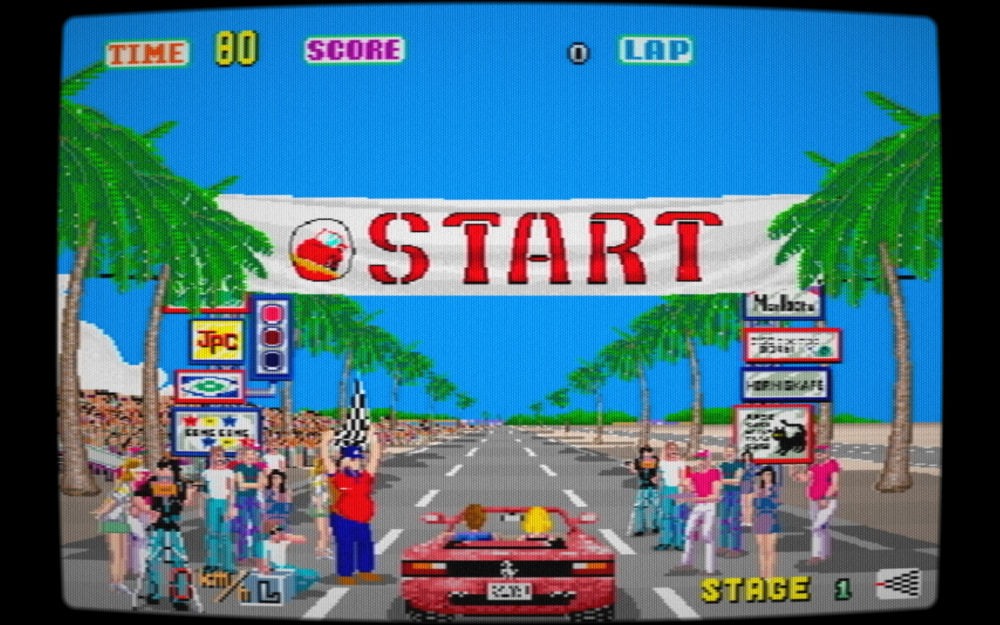

# CannonBall DX

*An arcade- and racing-wheel-focused fork of CannonBall-SE, based on Chris White's CannonBall OutRun engine.*

**CannonBall DX** builds on **CannonBall-SE by James Pearce (J1mbo)**, which itself is based on **CannonBall by Chris White**. The aim of this fork is to make CannonBall especially well suited to modern racing wheels, multi-device PC setups and dedicated arcade cabinets while keeping the original OutRun feel intact.

The additional work in this fork was developed with the assistance of **ChatGPT by OpenAI, using GPT-5.6 Sol**.

> **Platform status:** CannonBall DX is currently developed and tested **only on Windows 10/11 (64-bit)**. Linux, Raspberry Pi and other platforms have **not been tested with the DX changes**. The upstream CannonBall and CannonBall-SE projects support additional platforms, but no compatibility with CannonBall DX or its added features is claimed or guaranteed outside Windows.

> Official CannonBall-SE releases are available from the upstream project: https://github.com/J1mbo/cannonball-se/releases



---

## CannonBall DX Features

### Game Modes

**All game modes are selected directly in-game from the Music Select screen with the VIEW controls - no mode switching through settings menus.**

- **Original OutRun** - classic branching five-stage game
- **Original Japanese** - alternate early/Japanese program ROMs and course layout
- **Continuous Mode** - play all stages in one run with normal traffic and difficulty scaling
- **Endless Mode** - survival driving with rising difficulty, automatic music rotation and dedicated high scores
- **Time Trial** - three-lap course runs with **Traffic ON/OFF**, per-course records, fastest lap and total time

### Controls & Driving

- **True multi-device input** - wheel, pedals, shifter and buttons can come from different USB devices
- **Unified binding matrix** - separate Keyboard, Gamepad and Wheel assignments
- **Direct VIEW1 / VIEW2 / VIEW3 controls** plus the original view-cycle button
- **Expanded force feedback** - cornering, tyre slip, road texture, off-road, gears, crashes, spins and start/rev effects
- **Gamepad rumble** with separate enable and strength settings

### Display & Presentation

- **4:3, 16:9 and 21:9 ultrawide support**
- **xBRZ 3x/4x/5x/6x and HQX 3x/4x pixel scalers**
- **CRT / analogue video and NTSC filtering** inherited from CannonBall-SE
- **Enhanced Attract Mode** with automatic camera changes and cabinet-lamp choreography
- **Eight Ferrari colours** - Red, Blue, Yellow, Green, Cyan, Black, White and Silver
- **Configurable selection timers** - 15 sec, 30 sec or OFF
- **Dedicated Time Trial and Endless results / high-score presentation**

### Arcade Cabinet Features

- **START, BRAKE, VIEW, VIEW1, VIEW2 and VIEW3 lamp outputs**
- **MAME network output** support
- **Windows MAMEOutput / MAMEHooker** support
- **SmartyPi** output support
- **Automatic VIEW lamp effects** tied to Attract Mode camera changes

### ROM Features

- **Direct MAME ROM ZIP loading** - current merged `outrun.zip` can be used without extraction
- **Full backwards compatibility with traditional loose CannonBall ROM files**
- **Early/Japanese program-ROM data** detected by CRC when present
- **Corrected Sega/M2 PCM ROM preferred automatically**, with historical CannonBall patch and original ROM fallbacks

---

## Upstream Features

### CannonBall

**Chris White's CannonBall** provides the core C++ recreation and enhancement of Sega OutRun, including the game engine, ROM loading, enhanced modes, controls, widescreen support and steering-wheel force feedback.

### CannonBall-SE

**James Pearce's CannonBall-SE** adds a large range of cabinet, performance, audio and display improvements, including:

- CRT / analogue video processing and NTSC filtering
- High-resolution rendering improvements
- Gameplay fixes and enhancements
- Automatic 30/60 fps operation
- Multi-threaded rendering for low-power hardware
- WAV, MP3 and YM custom music support
- Machine play-count and runtime statistics
- Raspberry Pi watchdog support
- Numerous performance and stability improvements
- RISC-V RVV SIMD support and x86 SSE2 fallback contributed by **rtissera**

CannonBall already included steering-wheel force feedback. CannonBall DX **extends that existing system** rather than replacing a rumble-only implementation.

---

## Platform Support

### Tested

- **Windows 10/11 (64-bit)**

### Not tested with CannonBall DX

- Linux
- Raspberry Pi / Raspberry Pi OS
- Other platforms supported by upstream CannonBall or CannonBall-SE

The upstream projects contain support for additional operating systems and hardware, and some of that code remains present in CannonBall DX. However, **the DX fork and its added features are only tested on Windows**. Linux, Raspberry Pi and other builds may work fully, partially or not at all. No compatibility outside Windows should be assumed.

The expanded force-feedback implementation and modern wheel work in CannonBall DX are likewise tested only on Windows.

---

## ROMs

CannonBall DX requires the original **OutRun Revision B** ROM data. There are now two supported ways to provide it:

- Copy the traditional extracted CannonBall ROM files into `roms/`, exactly as before.
- Place a suitable MAME ZIP archive such as a current merged `outrun.zip` into `roms/` without extracting it.

ZIP entries are identified by **CRC32 and uncompressed size**, not by archive filename alone. This allows CannonBall DX to locate the Revision B data, the optional alternate early/Japanese program ROMs and corrected PCM data inside modern merged archives even when MAME uses different filenames or subdirectories.

**Backwards compatibility is intentional:** extracted ROMs remain fully supported and take priority when identical data exists both loose and inside a ZIP.

When `sound.fix_samples` is enabled, CannonBall DX prefers Sega/M2's official corrected PCM ROM (`C2DE09B2`), then accepts CannonBall's historical patched `opr-10188.71f` (`37598616`), and finally falls back to the original arcade `opr-10188.71` (`BAD30AD9`). No manual PCM patching is required when the official corrected ROM is present.

See `roms/roms.txt` for the legacy filenames and accepted PCM variants.

You are expected to legally own the original ROMs; usage may be restricted by local law.

---

## Quick Start - Linux (Untested)

> **CannonBall DX is not tested on Linux.** The following build path is inherited from the upstream project and is retained for convenience only. It should not be interpreted as an official CannonBall DX compatibility statement.

```bash
git clone https://github.com/Endprodukt/cannonball-dx.git
cd cannonball-dx
chmod +x install.sh
./install.sh
```

Then copy either the extracted OutRun Revision B ROMs or a suitable `outrun.zip` into `./roms/` and run:

```bash
build/cannonball-dx
```

---

## Quick Start - Windows

CannonBall DX can be compiled with Visual Studio.

See:

`docs/Compiling-On-Windows.txt`

The features documented here are included in the **`master`** branch.

---

## Controls and Multiple Devices

Controls are configured through:

**Menu -> Settings -> Controls**

The binding editor provides separate **Keyboard**, **Gamepad** and **Wheel** columns. Steering, accelerator, brake, shifter and buttons can be assigned independently, including devices such as separate USB pedals or shifters.

Device bindings store a persistent device signature so assignments survive changes in SDL device order.

### Default Keyboard Controls

- **Start:** `S`
- **Coin:** `C`
- **Accelerate:** `A`
- **Brake:** `Z`
- **Low / High Gear:** `G` / `H`
- **Steer:** Left / Right arrows
- **Change View:** `V`
- **Menu:** `M`
- **Quit:** `Esc`

Controls can be remapped in the in-game menu.

### Fixed Keyboard Hotkeys

These function keys are fixed and are not redefinable:

- **F1** Pause
- **F2** Frame step
- **F3** Freeze timer
- **F5** Menu
- **F6** Pixel-scaler quick cycle
- **F7** Hi-res sprites
- **F8** Video-processing toggle
- **F9** Shadow-mask toggle
- **F10** Ferrari colour

While the car is driving in Attract Mode, press **F10** to cycle the Ferrari colour. The selected colour is saved as the new default and is restored on future starts.

### Force Feedback settings

| XML option | Values | Description |
|---|---:|---|
| `controls.analog.haptic enabled` | `0` / `1` | Enables steering-wheel force feedback |
| `controls.analog.haptic.strength` | `10`-`100` | Overall FFB strength in percent |
| `controls.analog.haptic.centering_strength` | `0`-`100` | Spring reference strength used by the configurable spring curve |
| `controls.rumble` | `0.0`-`1.0` | Gamepad rumble level |

The normal in-game Controls menu intentionally stays simple: **FFB Strength** is the overall master and **Spring** sets the centering reference level. Users who want more control can edit the individual values inside `controls.analog.haptic.effects` and `controls.analog.haptic.spring` in `config.xml`. There is no separate Advanced mode: the values are always available. The default configuration intentionally leaves headroom so individual effects can be increased without starting at the 100 ceiling. Effect strengths and spring percentages use a clear **0-100** range.

The first-run FFB defaults are **enabled**, **FFB Strength 50** and **Spring 60**.

#### Per-effect tuning in config.xml

The effect names describe the physical cue they control. Changing one value does not enable a different FFB mode or replace the normal master setting.

| XML value under `haptic.effects` | DX default | Controls |
|---|---:|---|
| `sand` | 3 | Fine sand / rough-surface grit taps |
| `tyre_slip` | 11 | Sine vibration while the tyres slide on-road |
| `offroad_rumble_one_wheel` | 20 | Off-road vibration with one side of the car off the road |
| `offroad_rumble_full` | 30 | Off-road vibration with the whole car off the road |
| `offroad_pull_one_wheel` | 35 | Outward steering pull with one side off-road |
| `offroad_pull_full` | 21 | Outward steering pull when fully off-road |
| `gear_shift` | 49 | Gear-change kick and rebound |
| `music_selector` | 7 | Short Music Select step impulse between songs |
| `traffic_skid` | 70 | Steering yank after a traffic collision |
| `crash_bump` | 70 | Low-speed scenery impact |
| `crash_spin_impact` | 70 | Initial medium-speed spin impact |
| `crash_spin` | 70 | Repeated side loads during a scenery spin |
| `crash_flip_impact` | 70 | Initial high-speed flip impact |
| `crash_flip` | 70 | Repeated / sustained side loads during the flip |
| `crash_flip_landing` | 70 | Landing impact after a flip |
| `start_steering` | 70 | Automatic steering load as the Ferrari drives onto the start line |
| `start_rev_shake` | 11 | Throttle-dependent engine/rev shake before the start |

The supplied numbers are the actual CannonBall DX defaults, not a second preset layer. For example, `sand=3` is the restrained default grit setting; changing it to `80` deliberately makes that effect dramatically stronger. Values are limited to **0-100** so every strength entry has the same meaning.

#### Speed-dependent centering spring

The normal **Spring** menu option remains the reference value. The percentage entries below use **0-100**. The two speed thresholds are different: they use the game's vehicle-speed values, with a valid range of **0-294**. The standard car's maximum is **294**.

| XML value under `haptic.spring` | DX default | Valid range | Controls |
|---|---:|---:|---|
| `low_speed` | 28 | 0-100 | Spring percentage in menus, Attract Mode, stationary driving and low speed |
| `high_speed` | 70 | 0-100 | Spring percentage at high speed |
| `sliding` | 47 | 0-100 | Percentage of the currently active spring retained during on-road tyre slip |
| `speed_start` | 100 | 0-294 | Vehicle-speed point where the spring begins increasing |
| `speed_full` | 240 | 0-294 | Vehicle-speed point where the high-speed spring is reached |
| `traffic_skid` | 35 | 0-100 | Spring level during a traffic-collision skid |
| `crash_bump` | 46 | 0-100 | Spring level during a low-speed scenery bump |
| `crash_spin` | 25 | 0-100 | Spring level during the active scenery spin |
| `crash_recovery` | 49 | 0-100 | Spring level during spin recovery |
| `crash_flip_start` | 32 | 0-100 | Spring level at the start of a flip |
| `crash_flip_airborne` | 7 | 0-100 | Spring level while airborne |
| `crash_flip_transition` | 18 | 0-100 | Spring level through the flip transition |
| `crash_flip_landing` | 32 | 0-100 | Spring level at landing |
| `crash_flip_recovery` | 49 | 0-100 | Spring level during post-flip recovery |

With the default values, normal on-road steering behaves as follows:

- **Menu, Attract Mode, Music Select, stationary driving and vehicle speeds up to 100:** 28% of the configured Spring reference value
- **100-240:** spring strength rises continuously from 28% to 70% of the configured value
- **240-294:** spring remains at 70% of the configured value
- **Tyre slip / on-road sliding:** the currently active spring is reduced to 47%, then restored when grip returns

Examples with the default spring curve:

| Spring setting | Low speed / Menu / Attract | High speed | During tyre slip at high speed |
|---:|---:|---:|---:|
| 100% | 28% | 70% | ~33% |
| 80% | ~22% | 56% | ~26% |
| 60% | ~17% | 42% | ~20% |
| 50% | 14% | 35% | ~16% |

The Music Select screen keeps the configured low-speed spring and adds only short step impulses when moving between songs.

If multiple FFB devices are connected on Windows, a specific device can optionally be selected with the `FF_TARGET_VIDPID` environment variable.

Example:

```text
FF_TARGET_VIDPID=0x046d:0xc24f
```

---

## Music Select

Game mode selection is integrated directly into the Music Select screen:

- **VIEW** cycles through the available game modes
- **VIEW1** selects Original / Original Japanese
- **VIEW2** selects Continuous / Endless
- **VIEW3** selects Time Trial
- **LOW / HIGH gear** changes Ferrari colour
- **START** confirms the selection

Ferrari colours are **Red, Blue, Yellow, Green, Cyan, Black, White and Silver**. The Music Select colour applies **only to the next race** and does not replace the saved default. After the run, Attract Mode returns to the default colour selected with **F10**.

Custom music files can still be placed in `./res/` using:

```text
[01-99]_Track_Display_Name.[wav|mp3|ym]
```

Tracks `01-03` replace the original songs. Tracks `04+` add additional entries to the radio selector. On supported Windows wheels, the selector uses the normal low-speed centering spring plus short FFB steps between songs.

---

## Arcade Outputs

CannonBall DX exposes its lamp outputs through:

- **MAME network output**
- **Windows MAMEOutput messages / MAMEHooker**
- **SmartyPi**

Currently exposed lamps include **START**, **BRAKE**, **VIEW**, **VIEW1**, **VIEW2** and **VIEW3**.

See `EXTERNAL_OUTPUTS.md` for configuration details.

---

## Command-Line Options

- `-h` - Show options
- `-list-audio-devices` - List audio devices
- `-cfgfile <path>` - Use a specific config file
- `-file <layout>` - Load custom LayOut Editor track data
- `-30` / `-60` - Force frame rate
- `-t [1-4]` - Override hardware thread detection
- `-x` - Disable single-core Raspberry Pi detection
- `-1` - Use single-core mode
- `-perftest` - Maximum frame-rate performance test

---

## Credits

CannonBall DX builds directly on the work of the original projects and their contributors.

- **Chris White** - creator of the original **CannonBall** engine and core OutRun recreation
- **James Pearce (J1mbo)** - creator and maintainer of **CannonBall-SE**, including its cabinet, video, performance, audio and gameplay enhancements
- **Shay Green (Blargg)** - `snes_ntsc` NTSC filter library
- **Zenju** - author of **xBRZ**, used for the 3x/4x/5x/6x pixel-scaling modes
- **Maxim Stepin** and **Cameron Zemek** - authors/contributors of the **HQx** implementation used for the 3x/4x pixel-scaling modes
- **SourMesen / Mesen2 contributors** - source of the pinned HqMAME-derived xBRZ and HQx implementations used by the CannonBall DX build
- **Rich Geldreich and miniz contributors** - `miniz` ZIP/DEFLATE library used for direct ROM archive loading
- **rtissera** - RISC-V RVV 1.0 SIMD support and x86 SSE2 fallback
- **CannonBall and CannonBall-SE contributors** - fixes, ports, testing and improvements across both upstream projects
- **Endprodukt** - CannonBall DX fork, multi-device input, ultrawide, cabinet-output and modern wheel / feedback extensions
- **ChatGPT by OpenAI - GPT-5.6 Sol** - development assistance for the additional work in CannonBall DX

Upstream projects:

- CannonBall: https://github.com/djyt/cannonball
- CannonBall-SE: https://github.com/J1mbo/cannonball-se
- Mesen2 scaler source: https://github.com/SourMesen/Mesen2

---

## License

- **Upstream CannonBall license:** non-commercial use; modified redistributions must include full source; warranty disclaimer. See `docs/license.txt`.
- **CannonBall-SE additional terms:** SE enhancements © 2020-2025 James Pearce; provided "as is"; not for sale / monetisation; preserve notices. See `docs/CannonBall-SE-license.txt`.
- **xBRZ:** Copyright © Zenju; the HqMAME-derived implementation used by CannonBall DX is distributed under the **GNU GPL v3** with the exception text retained in the upstream source.
- **HQx:** Copyright © 2003 Maxim Stepin and © 2010 Cameron Zemek; licensed under the **GNU LGPL v2.1 or later**.
- **Blargg `snes_ntsc`:** licensed under **GNU LGPL v2.1**.
- **miniz:** public-domain / Unlicense terms.
- **Third-party notices:** see `docs/THIRD-PARTY-NOTICES.md`. The LGPL v2.1 text is included at `docs/LGPL-2.1.txt`.

*OutRun is a trademark of SEGA Corporation. This project is not affiliated with SEGA.*

---

## See Also

- Man page: `docs/cannonball-dx.6`
- Windows compiling guide: `docs/Compiling-On-Windows.txt`
